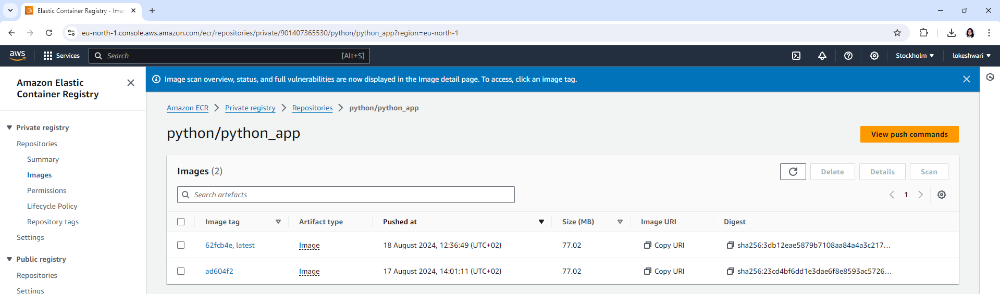

# Containerize Python API

The application is containerized using Docker. Deployment configurations are defined using Docker Compose. Continuous Integration (CI) and Continuous Delivery (CD) are implemented through GitHub Actions pipelines.

The project folder contains the following:

A Dockerfile for building the container image.
A docker-compose.yml file for defining and running multi-container Docker applications.
A GitHub Actions workflow file for CI

The Continuous Delivery (CD) pipeline is organized in a separate folder named CD, which includes scripts for infrastructure provisioning and application deployment, detailed later.

# Contineous Integration

### Docker Setup

Dockerfile sets up a Python 3.11 environment with Redis on a slim Debian base, installs dependencies, and copies application files. It exposes port 6379 and runs the Redis server alongside the Python app

Docker Compose file defines two services: a Python web app container and a Redis database container. The web app depends on Redis, with environment variables specified, and both containers are configured to restart unless stopped, with data persistence for Redis through a named volume

### Github CI workflow

The GitHub Actions CI pipeline (.github/workflows/docker_build.yml) is triggered by a push to the main branch. It runs on an Ubuntu environment and includes a Redis service. The pipeline performs several steps: it checks out the code, sets up a Python 3.11 environment, installs dependencies, and runs tests using pytest. If the tests pass, the pipeline authenticates with AWS ECR, builds a Docker image, and pushes it to the ECR repository. Finally, it tags the image as 'latest' if the push is on the main branch.

## Using the Application with GitHub CI Workflow

### Prerequisites

1. **AWS Account**: Ensure you have an AWS account with permissions to push images to ECR.
2. **GitHub Secrets**: Store the following credentials in GitHub Secrets:
   - `AWS_ACCESS_KEY_ID`
   - `AWS_SECRET_ACCESS_KEY`
   - `AWS_REGION`
   - `ECR_REPOSITORY`
3. **Update Docker Compose**: Replace the ECR repository ID in your Docker Compose file with your repository details.

### Instructions

1. **Clone the Repository**: Clone this repository to your local machine.
2. **Modify the Application**: Make any required changes to your application.
3. **Commit Your Changes**: Commit the changes to the repository.
4. **Trigger CI Workflow**: Push your changes to the repository. GitHub Actions will automatically trigger the CI workflow, which will build the Docker image and push it to ECR.

## Instructions to run the docker file on local 

* Modify docker-compose.yml file so that the py-web-app service uses a Dockerfile from a local folder instead of an image from an ECR repository. Remove the `image` directive and add a `build` section with `context` set to the path of the directory containing the Dockerfile.
* Execute `docker-compose` build and then `docker-compose up -d`. The application will be accessible in your browser at `http://localhost:5000.`

# Contineous Delivery

Continuous Delivery (CD) involves automating the deployment process to ensure that changes to infrastructure and applications are delivered. This implementation includes infrastructure provisioning using Terraform and application deployment with Chef. Refer pipeline in "/CD/.github/workflows/infrastructure_provision_and_deploy_.yml"

- Infrastructure Provisioning ("/CD/Infrastructure" Folder): Terraform is used to build and manage the infrastructure. The Terraform code is processed by GitHub Actions, which builds the code and generates a plan. This plan is then saved and uploaded to GitHub Artifacts for review. The infrastructure deployment is triggered manually after the plan has been reviewed and verified. the Terraform state file is stored in Amazon S3. The state file is referenced in each run to verify and manage the current state of the infrastructure.

- Application Deployment: The deployment of application is managed using Chef. The Docker Compose configuration is encapsulated in a Chef cookbook, which ensures that the latest application image is pulled from Amazon ECR and deployed each time the deployment is executed.

Note: Due to infrastructure limitations, the full Continuous Delivery pipeline has not been implemented. However, examples of the Terraform infrastructure code and Chef cookbook are provided in the folder for illustration purposes.

